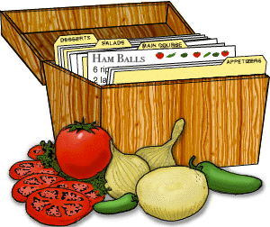

# O'Meara Family Recipes

[](https://travis-ci.org/bomeara/recipes)




This is a repo for dynamically creating a website for storing and hosting O'Meara family recipes. You can see them at https://bomeara.github.io/recipes/.

It was forked from https://github.com/jmwerner/recipes. Thanks for your work, @jwerner!

To add a recipe

```
cd recipeInput
./launchInputApp.sh
cd ../generator
./generateWebpages.sh
git add ../allRecipes/*/*
git add ../docs/allRecipes/*/*
git commit -m"added another recipe" -a
git push
```

To install the necessary code to run locally

```
pip install beautifulsoup4
pip install lxml
```

### Sources of inspiration/code robbing
* [Werner's Recipes](https://github.com/jmwerner/recipes)
* [Hadley's Recipes](https://github.com/hadley/recipes)
* [Dean Attali's Shiny Examples](https://github.com/daattali/shiny-server/tree/master/mimic-google-form)
* [Google Web Starter Kit](https://github.com/google/web-starter-kit)
* [HTML5 UP](https://html5up.net/)
